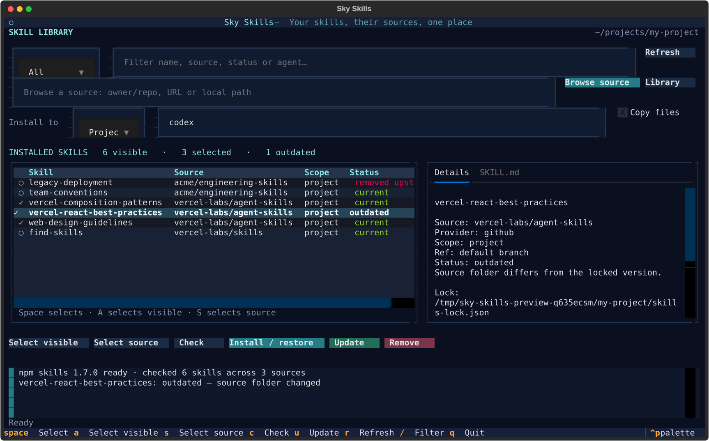

# Sky Skills

A Textual TUI for [npm skills](https://github.com/vercel-labs/skills), driven by its existing project and global lock files. Inspect origins and skill content, browse repositories, select a whole source, install in bulk, check for updates, restore missing installations, and remove skills.

```bash
uv tool install .
sky-skills
```

Python 3.11+ and Git are required. Node and npm are included through `nodejs-wheel`; the supported npm `skills` release is installed privately on first launch. No global npm installation is needed. For unattended setup, run `sky-skills setup`.

```bash
sky-skills --project ~/my-project
sky-skills list --json
sky-skills doctor
sky-skills setup --upgrade
```



Press **Space** to select, **A** to select visible skills, **S** to select a source, **C** to check, and **U** to update. Enter a repository or local path in **Browse source** to select and install several skills at once. The target scope, agent names, and copy setting control installation and updates. Removal opens a review dialog.

Project `skills-lock.json` (v1) and global `.skill-lock.json` (v3) remain the source of truth. The app never migrates or rewrites locks itself. A confirmed missing skill is marked **removed upstream**; authentication failures, offline sources, and missing remote repositories are marked **source unavailable** because deletion cannot be confirmed. Old and future schemas remain visible and block mutations.

The managed CLI is **skills 1.7.0**, verified by live contracts. Published npm behavior is tested directly. Global local-path installs are blocked because this release does not track them in its lock; use project scope or a Git URL. Well-known/download/npm sources have limited health checking. See [compatibility details](docs/compatibility.md).

## Development

Hatch builds and manages environments, with uv as its installer.

```bash
uv sync
uv run hatch run check
uv run hatch run integration
uv run hatch run docs
uv run hatch build
```

Fast tests use pytest and Textual Pilot. Live contracts exercise the actual npm binary against temporary homes and a local smart-HTTP Git server. Add `--network` for the public GitHub tree-hash contract.

```bash
uv run pytest --integration --network
# Probe a candidate release without declaring it supported:
uv run pytest --integration --skills-version 1.7.0
```

Documentation is built with [Zensical](https://zensical.org/). Run `uv run hatch run serve-docs` to view it. See [the developer guide](docs/development.md) for compatibility maintenance and the full test loop.
